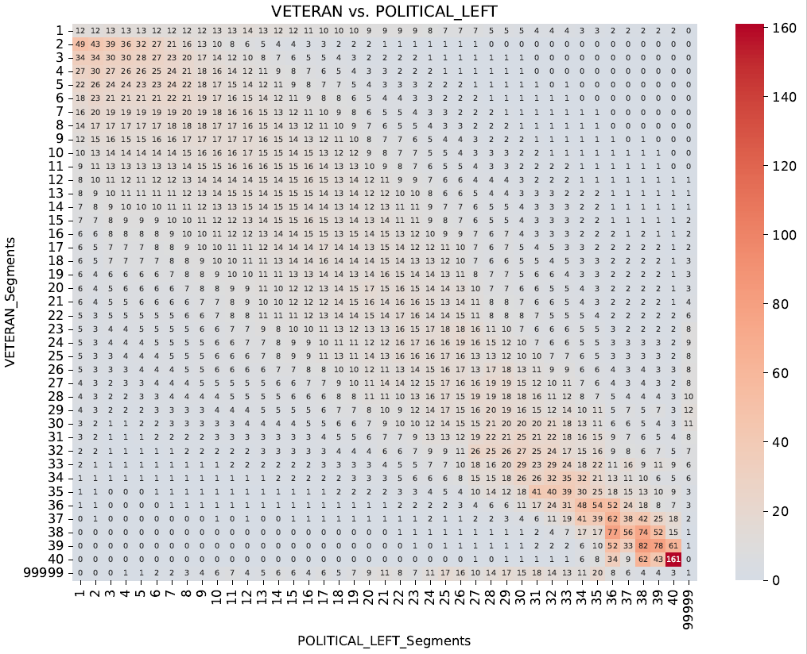
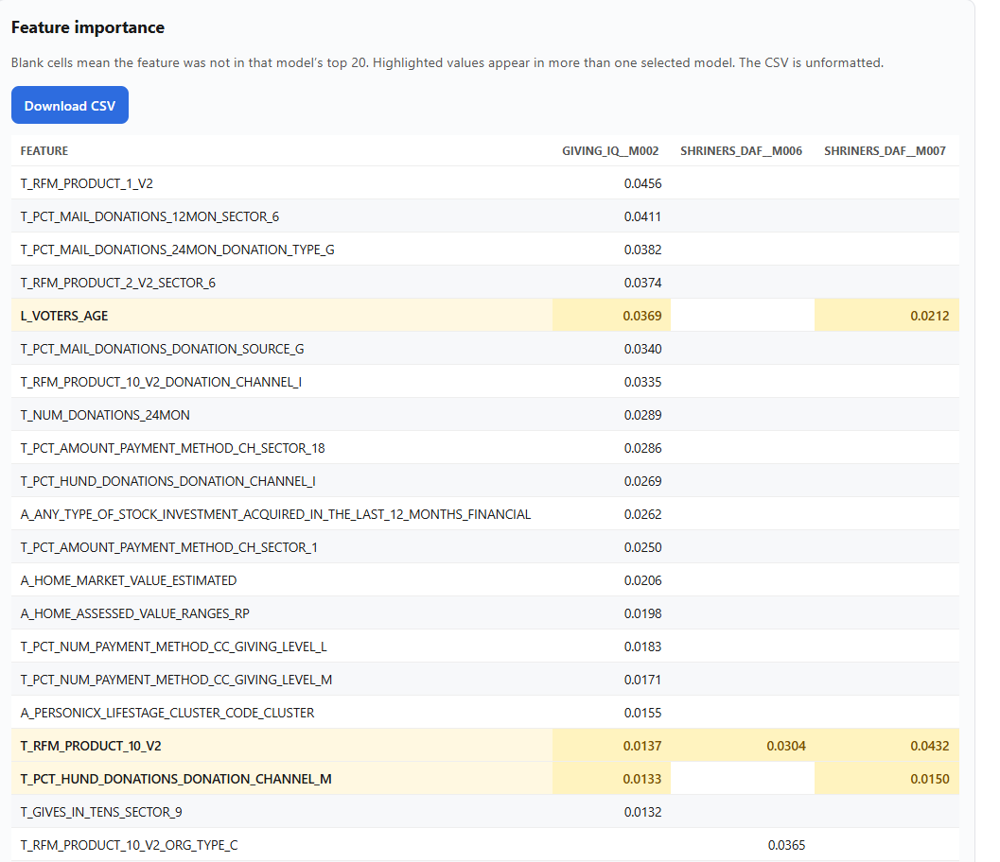

# TCAT Analytics

Flask GUI around the existing Snowflake ODBC workflow: connect once, navigate through menu option to explore various analytics from existing TCAT models.

# Overview:

- **Snowflake connection** — posts `dsn` and `username` to `/api/connect` and caches the ODBC session
- **Model segment comparison** — project search, scoring-run picker, comparison list, and heatmap PDF download
- **Model feature comparison** — project search, modeling-run picker, then a side-by-side importance table (w/csv download)

## Run locally

Windows with a Snowflake ODBC DSN (the original setup):

```bash
python -m venv venv
venv\Scripts\activate
pip install -r requirements.txt
copy .env.example .env
python app.py
```

The app listens on [http://127.0.0.1:5000](http://127.0.0.1:5000). Do not use port 48631.

Set `SNOWFLAKE_DSN` / `SNOWFLAKE_USER` in `.env`, or enter them on the connection page. The first Connect click is when the browser SSO prompt should appear.

## Model Segment Comparison

 Returns HeatMaps based on Scoring Runs selected, in a pairwise combination.
 
 Numbers displayed are pid count/10,000 for every model segment combination, with the color scale centered on the mean. 

 

## Feature importance table

The Top 20 Features and Importance of the selected models are displayed in a table/grid format.

This visual allows for identifying where models top 20 features overlap amongst the selected models.

Visual is displayed in the user interface as well a

*Blank values mean that model did not have that feature in their Top 20

